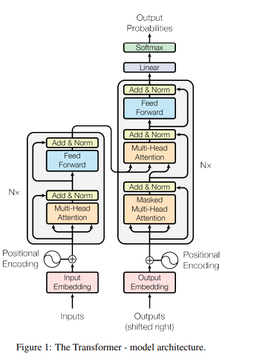
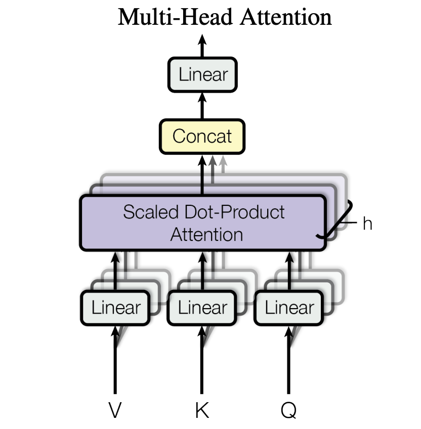

# Attention, Self-Attention, Cross-Attention, Transformer

- [Attention, Self-Attention, Cross-Attention, Transformer](#attention-self-attention-cross-attention-transformer)
- [Intuition behind attention](#intuition-behind-attention)
- [Deep-Dive in the Transformer](#deep-dive-in-the-transformer)
  - [the **Encoder** Block](#the-encoder-block)
  - [Sum-up of parameters](#sum-up-of-parameters)
- [Useful links](#useful-links)

  

# Intuition behind attention

The goal of attention : learning from sequences.   
Attention is context-based query : it makes a query with a vector and looks at similar things in your past.
> Dot-attention attention   
> $Attention(Q,K,V) = softmax(\frac{QK^T}{\sqrt{d_k}})V$

i.e, from a query, we want to find the most similar key and then get the values that corresponds to the similar keys.

In details : 
-  The mask, $softmax(\frac{QK^T}{\sqrt{d_k}})$, gives a probability distribution over key, which is peak at the ones which are similar to the query. 
-  $softmax(\frac{QK^T}{\sqrt{d_k}})*V$, multiply value by this mask.

# Deep-Dive in the Transformer
## the **Encoder** Block 

  

- $N$x : number of encoder blocks
- Add & Norm :
    - Add : residual connection  
    $x + \text{Sublayer}(x)$, where sub-layer is either multi-head-attention or feed-forward network
    - Norm : layer normalization
    Layer Norm. 

    The output is : $LayerNorm(x + \text{Sublayer}(x))$.

    To ease the residual connection, all sub-layers in the model and the embedding layer produce outputs of dimension $d_{\text{model}}=512$.
- Attention  
    An attention function can be described as mapping a query and a set of key-value pairs to an output, where the query, keys, values, and output are all vectors. The output is computed as a weighted sum of the values, where the weight assigned to each value is computed by a compatibility function of the query with the corresponding key.  
    We call our particular attention **“Scaled Dot-Product Attention”**. The input consists of queries and keys of dimension $d_k$, and values of dimension $d_v$. We compute the dot products of the query with all keys, divide each by $\sqrt{d_k}$, and apply a softmax function to obtain the weights on the values.
    

      
    

    In practice, we compute the attention function on a set of queries simultaneously, packed together into a matrix $Q$. The keys and values are also packed together into matrices $K$ and $V$. We compute the matrix of outputs as
    We compute the matrix of outputs as  $Attention(Q,K,V) = softmax(\frac{QK^T}{\sqrt{d_k}})V$
- Multi-head Attention
  Multi-head attention allows the model to jointly attend to information from different representation subspaces at different positions. With a single attention head, averaging inhibits this.
    

      
    

    $MultiHeadAttention(Q, K, V) = Concat(head_1, ..., head_h) * W^O$  
    where $head_i = Attention(QW_i^Q, KW_i^K, VW_i^V)$

    Where the projections are parameter matrices $W_i^Q \in \mathbb{R}^{d_{\text{model}} \times d_k}$, $W_i^K \in \mathbb{R}^{d_{\text{model}} \times d_k}$, $W_i^V \in \mathbb{R}^{d_{\text{model}} \times d_v}$ and $W^O \in \mathbb{R}^{hd_v \times d_{\text{model}}}$.

    Usually, we employ : $h=8$, $d_k=d_v=d_{\text{model}}/h=64$.
    Due to the reduced dimension of each head, the total computational cost is similar to that of single-head attention with full dimensionality.
- Feed-Forward Network
    $FFN(x) = max(0, xW_1 + b_1)W_2 + b_2$
    While the linear transformations are the same across different positions, they use different parameters from layer to layer. Another way of describing this is as two convolutions with kernel size 1. The dimensionality of input and output is $d_model = 512$, and the inner-layer has dimensionality $d_{ff} = 2048$.
- Positional Encoding

## Sum-up of parameters
  - $N$ : number of encoder blocks
  - $d_{model}$: dimension of the model, used all across the model (512)
  - $d_{ff}$: dimension of the feed-forward network (the dim between the two linear layers) (2048)
  - $h$: number of heads in the multi-head attention (8)
  - $d_k$, $d_v$, $d_q$ : dimension of the keys, values, queries (64) ($d_k = d_v = d_{model} / h$)

# Useful links
- [Attention Is All You Need](https://arxiv.org/abs/1706.03762)
- [The Illustrated Transformer](http://jalammar.github.io/illustrated-transformer/)
- [The Annotated Transformer](https://nlp.seas.harvard.edu/2018/04/03/attention.html)
- [Attention is all you need; Attentional Neural Network Models | Łukasz Kaiser | Masterclass](https://www.youtube.com/watch?v=rBCqOTEfxvg)