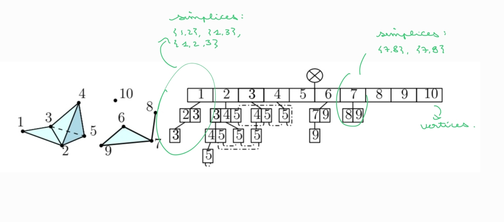

# TDA
- [TDA](#tda)
  - [Background](#background)
  - [Simplex tree](#simplex-tree)
    - [In gudhi :](#in-gudhi-)
- [References](#references)

## Background 

## Simplex tree
Data strucutre to represent abstract simplicial complexes of any dimension[1]. 

> **Definition**   
> Let $K=(V,S)$ be a simplicial complex of dimesions $k$. The vertices are labelled from $1$ to $|V|$. Specially, a $j-$simplex of $K$ is uniquely represented as the word of legth $j + 1$ consisting of the ordered set of the labels of its $j + 1$ vertices.   
> Formally, let $\sigma = \{v_{l0}, ...,  v_{lj}\} \in S$, where $v_{li} \in V$, $l_{li} \in \{1, ..., |V|\}$ and $l_0 < ... < l_j$. $\sigma$ is then represented by the word $[\sigma] = [l_0, ..., l_j]$. The last label of the word representation  will he last label of $\sigma$ and denoted $last(\sigma)$.  

To represent the set of simplices of $K$, the words are stored in a tree and satisfies the following properties :  
1. The nodes of the simplex tree are in bijection with the simplices (of all dimensions) of the complex. The root is associated to the empty face.  
2. Each node of the tree, except the root stores the label of a vertex. Especially, a node associated to a simplex $\sigma \neq \emptyset$ stores the label $last(\sigma)$.  
3. The vertices whose labels are encountered along a path from the root to a node associated to simplex $\sigma$ are the vertices of $\sigma$. Along such a path, the labels are sorted by increasing order and each label appears no more than once.

*Nota bene* : 
- the depth of the root is 0
- the depth of a node is equal to the dimension of the simplex is represent. 
- The children of the root are called the *top nodes*. The top nodes are in bijection with $V$.
- When inserting the words 

The construstion of a simplex tree : 
- When inserting $[\sigma] = [l_0, ..., l_j]$, we start from the root., and follow the path containing successively all labels $l_0, ..., l_i$ where $[l_0, ..., l_i]$. We then append to the node representing $[l_0, ..., l_i]$ a path consisting of the nodes storing $l_{i + 1}, ..., l_j$

### In gudhi : 

[Tutorial on simplex trees](https://github.com/GUDHI/TDA-tutorial/blob/master/Tuto-GUDHI-simplex-Trees.ipynb)

# References
[1] : Boissonnat, JD., Maria, C. The Simplex Tree: An Efficient Data Structure for General Simplicial Complexes. Algorithmica 70, 406–427 (2014). https://doi.org/10.1007/s00453-014-9887-3

