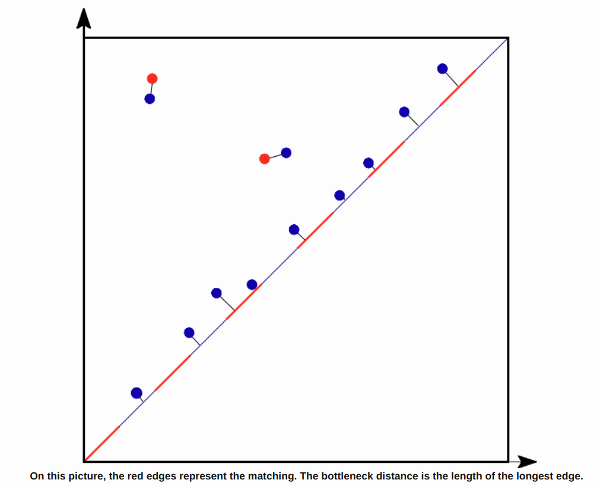
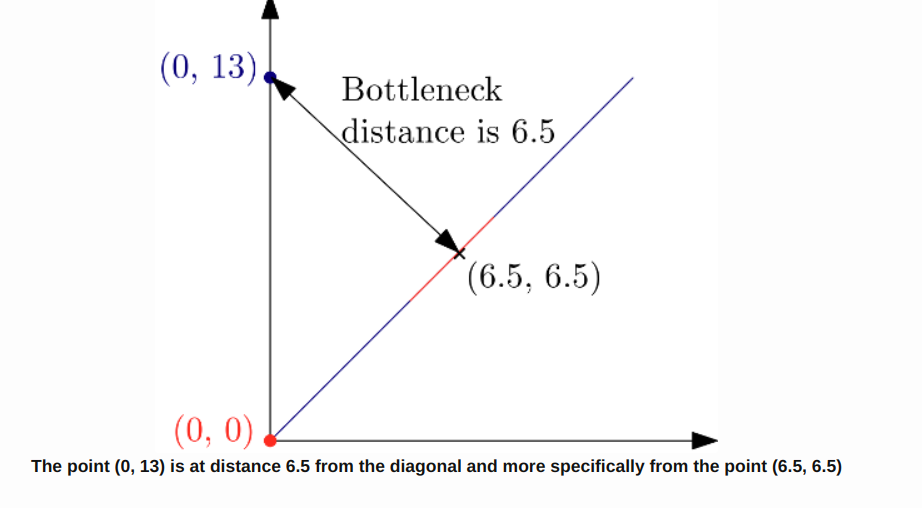

# Persistent Homology

- [Persistent Homology](#persistent-homology)
  - [Intuition](#intuition)
  - [Persistence for a function](#persistence-for-a-function)
  - [Persistent diagrams and barcodes](#persistent-diagrams-and-barcodes)
  - [Distances](#distances)
    - [Bottleneck distance](#bottleneck-distance)
    - [Wasserstein distance](#wasserstein-distance)

## Intuition
A general framework to encode the evolution of the topology (homology) of families of nested sets (filtered complex, sub-level sets). 

## Persistence for a function 
Filtration (nested families) of  the sublevel-sets $f^{-1}([-\inf, \alpha])$ for $\alpha \in [-\inf, +\inf ]$.

The relation of the sublevel-sets of a function and a simplicial complex : 
- The filtration of f by the sublevel-sets of the function : $\forall t \leq t' \in \R, f^{-1}([-\inf, t]) \subseteq f^{-1}([-\inf, t'])$
- If $f$ is defined at the vertices of a simplicical complex $K$, the sublevel sets filtration is a filtration of the simplicial complex $K$.  
For $\sigma = [v_0, ..., v_k] \in K$, $f(\sigma) = \max_{i=0, ..., k} f(v_i)$ and the simplices of $K$ are ordered according to increasing f values. 

## Persistent diagrams and barcodes

> **Definition** The persistent diagram of $M$, denoted by $Diag M$, is the multiset of points $\{(b_j,d_j) | j \in J \}$ where $b_j \leq d_j$ denote the endpoints of interval $I_j$ in the decomposition of $M$.

## Distances 
### Bottleneck distance

Measures the similarity between two persistence diagrams. It is the shortest distance b for which there exists a perfect matching between the two points of the diagonal (completed with all the points on the diagonal in order to bypass cardinality mismatch) such that any couple of matched points are at distance at most b, where the distance between points is the sup-norm in $\R^2$. 

> **Definition**
> The bottleneck distance between $C$ and $D$ is :  
> $d_B(C, D) = inf\{c(\chi) : \chi$ is a matching between $C$ and $D$ $\}$

- [Example of matching](https://gudhi.inria.fr/doc/latest/group__bottleneck__distance.html#:~:text=The%20bottleneck%20distance%20is%20the%20length%20of%20the%20longest%20edge.)

- Example of bottleneck distance 

### Wasserstein distance 

The q-Wasserstein distance is defined as the minimal value achieved by a perfect matching between the points of the two diagrams (+ all diagonal points), where the value of a matching is defined as the q-th root of the sum of all edge lengths to the power q. Edge lengths are measured in norm p, for $1 \leq p \leq \inf$.

