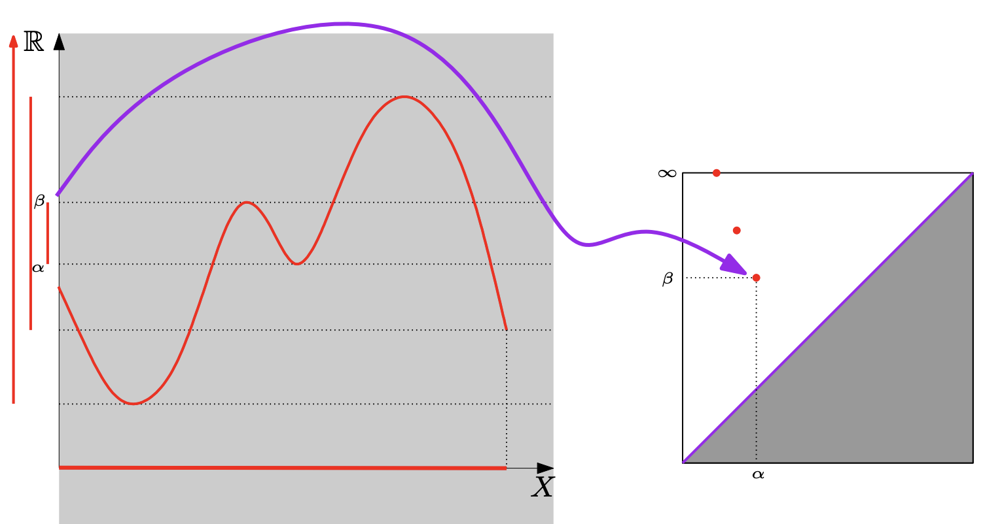

# Persistent Homology

- [Persistent Homology](#persistent-homology)
- [Intuition](#intuition)
  - [Persistence for a function](#persistence-for-a-function)

# Intuition
A general framework to encode the evolution of the topology (homology) of families of nested sets (filtered complex, sub-level sets). 

## Persistence for a function 
Filtration (nested families) of  the sublevel-sets $f^{-1}([-\inf, \alpha])$ for $\alpha \in [-\inf, +\inf ]$.

The relation of the sublevel-sets of a function and a simplicial complex : 
- The filtration of f by the sublevel-sets of the function : $\forall t \leq t' \in \R, f^{-1}([-\inf, t]) \subseteq f^{-1}([-\inf, t'])$
- If $f$ is defined at the vertices of a simplicical complex $K$, the sublevel sets filtration is a filtration of the simplicial complex $K$.  
For $\sigma = [v_0, ..., v_k] \in K$, $f(\sigma) = \max_{i=0, ..., k} f(v_i)$ and the simplices of $K$ are ordered according to increasing f values. 
