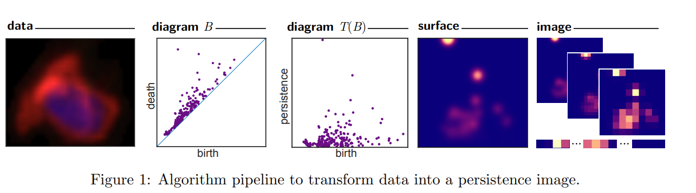

# Vectorization techniques in TDA

- [Vectorization techniques in TDA](#vectorization-techniques-in-tda)
  - [Persistence images](#persistence-images)

## Persistence images 

Persistence images are produced from a PD by taking a weighted sum of Gaussiancs centered at each point. The vectors, or PI, by integrating the surfaces over a grid. 

[Persistence Images: A Stable Vector Representation of Persistent Homology, Adams et al., 2016](https://arxiv.org/pdf/1507.06217.pdf)

The pipeline  

- Diagram $T(B)$  
  Let $B$, be a PD in birth-death coordinates. Let $T: \R^2 \to \R$ be the linear transformation $t(x,y) = (x, y-x)$, and let $T(B)$ be the transformed multiset in birth-persistence coordinates. Each point $(x, y) \in B$ correspond to the point $(x, y-x) \in T(B)$.
- Surface  
  Let $\phi_u : \R^2 \to \R$ be a differentiable probability distribution with mean $u = (u_x, u_y) \in \R^2$. In all the applications, the distribution is chosen to be normalized symmetric Gaussian. $\phi_u = g_u$ with mean $u$ and variance $\sigma^2$. 

  A nonnegative weighting function : $f : \R^2 \to \R$ that is zero along the horizontal axis, continous and piecewise differentiable. A grid in the plane with $n$ boxes is fixed and assign to each the integral of $\rho_B$ over that region. 
  
  The PD can now be transformed into a surface : 
  $\rho_B(z) = \sum f(u)\phi_u(z)$ for $u \in T(B)$

- Image 
  The surface $\rho_B(z)$ is reduced to a finite dimensional vector by discretizing a relevant subdomain and integrating $\rho_B$ over each region in the discretization. 
 

> **Definition** For $B$ a $PD$, its persistent image is the collection of pixels $I(\rho_B)_p = \int\int_p\rho_Bdydx$. 

NB :  
- Smoothing the PD in a surface (improves stability i.e with just superimposing a grid : a small movement of a point in the PD may move it to another bin)
- The resolution of the PI corresponds to the grid being overlaid on the PD. 
- Distribution : gaussian which depends on the choice of variance
